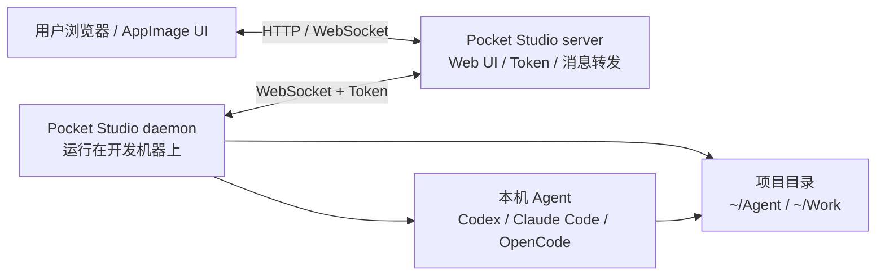

# Pocket Studio

Pocket Studio 是一个远程 AI 编程工作台。你可以把它理解成“浏览器里的开发控制台”：server 负责提供入口和转发消息，daemon 运行在你的开发机器上，真正访问项目目录并调用本机已安装的 agent，例如 Codex、Claude Code、OpenCode 等。

它适合这些场景：

- 在浏览器或桌面 App 里统一管理多台开发机器。
- 把家里、公司、服务器上的项目目录接到同一个 Studio。
- 让 agent 在真实开发机器上执行，而不是把代码上传到第三方环境。
- 自己用固定 token 快速部署，也可以开放注册给多人使用。

## 架构图



## 组件

- `server`：提供 Web 页面、用户/token 管理，并转发 Studio 和 daemon 消息。
- `daemon`：运行在开发机器上，连接 server，上报项目目录并执行 agent。
- `AppImage`：桌面端入口，可以单机运行，也可以连接远程 server。

所有配置都通过命令行参数传入：server 使用 `-server.*`，daemon 使用 `-daemon.*`，AppImage 使用 `--server.*`、`--daemon.*`、`--ui.*`。

## 1. 单机模式

下载 Linux AppImage 后直接启动：

```bash
chmod +x pocket-studio-all-linux-x86_64-0.0.4.AppImage
./pocket-studio-all-linux-x86_64-0.0.4.AppImage
```

默认等价于同时启动：

```bash
./pocket-studio-all-linux-x86_64-0.0.4.AppImage ui server daemon
```

单机模式会在本机启动 UI、server、daemon。默认不启用用户注册登录，也不需要 token。

## 2. 快速开始 - 自用模式

自用模式适合只给自己使用。server 不开启注册登录，但设置一个固定 `admin-token`；Studio 和 daemon 都使用这个 token。

### 2.1 server 示例启动参数

启动 server：

```bash
./pocket-studio-server-linux-x86_64-0.0.4 \
  -server.addr :18080 \
  -server.admin-token ps_admin_xxxxx
```

访问：

```text
http://<server-host>:18080/studio/?server_url=http://<server-host>:18080&token=ps_admin_xxxxx
```

### 2.2 daemon 示例启动参数

在开发机器上启动 daemon：

```bash
./pocket-studio-daemon-linux-x86_64-0.0.4 \
  -daemon.server.url ws://<server-host>:18080/ws/daemon \
  -daemon.server.token ps_admin_xxxxx \
  -daemon.workspace ~/Agent
```

多个项目目录可以重复传 `-daemon.workspace`：

```bash
./pocket-studio-daemon-linux-x86_64-0.0.4 \
  -daemon.server.url ws://<server-host>:18080/ws/daemon \
  -daemon.server.token ps_admin_xxxxx \
  -daemon.workspace main:Main:~/Agent \
  -daemon.workspace work:Work:~/Work
```

### 2.3 自用模式 AppImage 如何配置 server 地址

只打开 AppImage UI，并连接远程 server：

```bash
./pocket-studio-all-linux-x86_64-0.0.4.AppImage ui \
  --ui.server.url=http://<server-host>:18080
```

打开后在设置里填写：

```text
Server URL: http://<server-host>:18080
Access Token: ps_admin_xxxxx
```

也可以直接用 AppImage 启动 daemon：

```bash
./pocket-studio-all-linux-x86_64-0.0.4.AppImage daemon \
  --daemon.server.url=ws://<server-host>:18080/ws/daemon \
  --daemon.server.token=ps_admin_xxxxx \
  --daemon.workspace=~/Agent
```

## 3. 快速开始 - 开放注册模式

开放注册模式适合多人使用。server 开启注册登录，用户在首页注册、登录并创建自己的 token；daemon 使用对应 token 连接后，只会出现在这个用户的 Studio 里。

### 3.1 server 示例启动参数

启动开放注册 server：

```bash
./pocket-studio-server-linux-x86_64-0.0.4 \
  -server.addr :18080 \
  -server.auth.enabled \
  -server.auth.allow-register=true \
  -server.auth.db ~/.config/pocket-studio/server-auth.sqlite
```

用户访问首页注册登录：

```text
http://<server-host>:18080/
```

登录后创建 token，再进入 Studio。

### 3.2 daemon 示例启动参数

使用用户自己的 token 启动 daemon：

```bash
./pocket-studio-daemon-linux-x86_64-0.0.4 \
  -daemon.server.url ws://<server-host>:18080/ws/daemon \
  -daemon.server.token ps_user_xxxxx \
  -daemon.workspace ~/Agent
```

## 4. server、agent 参数介绍

### server 参数

| 参数 | 默认值 | 说明 |
| --- | --- | --- |
| `-server.addr` | `:8080` | HTTP 监听地址。 |
| `-server.admin-token` | 空 | 管理员 token。未开启认证时可用于自用模式；开启认证时作为内置管理员 token。 |
| `-server.auth.enabled` | `false` | 是否开启注册登录和 token 认证。 |
| `-server.auth.db` | 用户配置目录下的 `pocket-studio/server-auth.sqlite` | 用户、会话、token 的 sqlite 数据库路径。 |
| `-server.auth.allow-register` | `true` | 开启认证后是否允许新用户注册。 |

### daemon / agent 参数

| 参数 | 默认值 | 说明 |
| --- | --- | --- |
| `-daemon.device.id` | `dev_local` | 设备 ID。 |
| `-daemon.device.name` | 当前主机名 | Studio 中显示的设备名称。 |
| `-daemon.server.url` | `ws://localhost:8080/ws/daemon` | daemon 连接的 server WebSocket 地址。 |
| `-daemon.server.token` | 空 | 连接 server 使用的 token。 |
| `-daemon.workspace` | `~/Agent` | 项目目录，可重复传。支持 `id:name:path` 格式，其中 `id` 是内部标识，`name` 是页面显示名，`path` 是本机项目路径。 |

### AppImage 常用参数

| 参数 | 说明 |
| --- | --- |
| `ui` | 只启动桌面 UI。 |
| `server` | 启动内置 server。 |
| `daemon` | 启动内置 daemon。 |
| `--ui.server.url` | UI 连接的 server HTTP 地址。 |
| `--server.addr` | 内置 server 监听地址。 |
| `--daemon.server.url` | 内置 daemon 连接的 server WebSocket 地址。 |
| `--daemon.server.token` | 内置 daemon 连接 server 使用的 token。 |
| `--daemon.workspace` | 内置 daemon 使用的项目目录。 |
