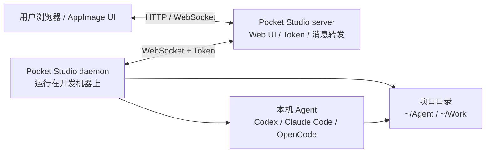

# Pocket Studio

[](https://go.dev)
[](LICENSE)
[](https://github.com/your-org/pocket-studio/releases)
[](#)

Pocket Studio 是一个远程 AI 编程工作台。你可以把它理解成**"浏览器里的开发控制台"**——Server 负责提供入口和转发消息，Daemon 运行在你的开发机器上，真正访问项目目录并调用本机已安装的 AI Agent（如 Claude Code、Codex、OpenCode 等）。

### 适用场景

- 在浏览器或桌面 App 里统一管理多台开发机器
- 把家里、公司、服务器上的项目目录接到同一个 Studio
- 让 Agent 在真实开发机器上执行，而不是把代码上传到第三方环境
- 自己用固定 Token 快速部署，也可以开放注册给多人使用

---

## 目录

- [架构](#架构)
- [组件](#组件)
- [快速开始](#快速开始)
  - [单机模式](#1-单机模式)
  - [自用模式](#2-快速开始---自用模式)
  - [开放注册模式](#3-快速开始---开放注册模式)
- [参数参考](#4-serveragent-参数参考)
- [从源码构建](#从源码构建)
- [项目结构](#项目结构)
- [开发指南](#开发指南)
- [常见问题](#常见问题)

---

## 架构



**通信流程：**

1. 用户通过浏览器或桌面 AppImage 访问 Server 的 Web UI
2. Server 通过 WebSocket 将任务转发给 Daemon
3. Daemon 在本机项目目录中执行 Agent（Claude Code / Codex / OpenCode 等）
4. Agent 的输出实时流式传输回浏览器

---

## 组件

| 组件 | 说明 |
|------|------|
| **`server`** | Web 服务器，提供 Studio UI 和用户首页，管理 Token 认证，转发 WebSocket 消息 |
| **`daemon`** | 运行在开发机器上的守护进程，连接 Server，管理项目目录并执行 Agent |
| **`AppImage`** | 桌面端入口（Linux），可以单机运行（内置 Server + Daemon），也可以仅作为 UI 连接远程 Server |

所有配置都通过命令行参数传入：

- Server 使用 `-server.*` 参数
- Daemon 使用 `-daemon.*` 参数
- AppImage 使用 `--server.*`、`--daemon.*`、`--ui.*` 参数

---

## 快速开始

### 1. 单机模式

下载 Linux AppImage 后直接启动：

```bash
chmod +x pocket-studio.AppImage
./pocket-studio.AppImage
```

默认等价于同时启动：

```bash
./pocket-studio.AppImage ui server daemon
```

单机模式会在本机启动 UI、Server、Daemon，默认不启用用户注册登录，也不需要 Token。

---

### 2. 快速开始 - 自用模式

适合只给自己使用。Server 不开启注册登录，但设置一个固定 `admin-token`；Studio 和 Daemon 都使用这个 Token。

**启动 Server：**

```bash
./server \
  -server.addr :18080 \
  -server.admin-token ps_admin_xxxxx
```

访问：[`http://<server-host>:18080/studio/`](http://localhost:18080/studio/)

**在开发机器上启动 Daemon：**

```bash
./daemon \
  -daemon.server.url ws://<server-host>:18080/ws/daemon \
  -daemon.server.token ps_admin_xxxxx \
  -daemon.workspace ~/Agent
```

**AppImage 连接远程 Server：**

```bash
./pocket-studio.AppImage
```

打开后在设置里填写：

```
Server URL: http://<server-host>:18080
Access Token: ps_admin_xxxxx
```

---

### 3. 快速开始 - 开放注册模式

适合多人使用。Server 开启注册登录，用户在首页注册、登录并创建自己的 Token；Daemon 使用对应 Token 连接后，只会出现在该用户的 Studio 里。

**启动开放注册 Server：**

```bash
./server \
  -server.addr :18080 \
  -server.auth.enabled \
  -server.auth.allow-register=true \
  -server.auth.db ~/.config/pocket-studio/server-auth.sqlite
```

用户访问首页注册登录：[`http://<server-host>:18080/`](http://localhost:18080/)

登录后创建 Token，再进入 Studio。

**使用用户自己的 Token 启动 Daemon：**

```bash
./daemon \
  -daemon.server.url ws://<server-host>:18080/ws/daemon \
  -daemon.server.token ps_user_xxxxx \
  -daemon.workspace ~/Agent
```

---

### 4. Server / Agent 参数参考

#### Server 参数

| 参数 | 默认值 | 说明 |
|------|--------|------|
| `-server.addr` | `:8080` | HTTP 监听地址 |
| `-server.admin-token` | 空 | 管理员 Token。未开启认证时可用于自用模式；开启认证时作为内置管理员 Token |
| `-server.auth.enabled` | `false` | 是否开启注册登录和 Token 认证 |
| `-server.auth.db` | 用户配置目录下的 `pocket-studio/server-auth.sqlite` | 用户、会话、Token 的 SQLite 数据库路径 |
| `-server.auth.allow-register` | `true` | 开启认证后是否允许新用户注册 |

#### Daemon / Agent 参数

| 参数 | 默认值 | 说明 |
|------|--------|------|
| `-daemon.device.id` | `dev_local` | 设备 ID（若未指定，自动生成并持久化到 `device.json`） |
| `-daemon.device.name` | 当前主机名 | Studio 中显示的设备名称 |
| `-daemon.server.url` | 必填 | Daemon 连接的 Server WebSocket 地址 |
| `-daemon.server.token` | 必填 | 连接 Server 使用的 Token |
| `-daemon.workspace` | `~/Agent` | 项目目录，可重复传。支持 `id:name:path` 格式，其中 `id` 是内部标识，`name` 是页面显示名，`path` 是本机项目路径 |
| `-daemon.acpx.enabled` | `true` | 是否启用 acpx Agent 执行 |
| `-daemon.acpx.command` | `acpx` | acpx 命令路径 |
| `-daemon.acpx.agent` | `claude` | acpx 默认使用的 Agent |
| `-daemon.acpx.ttl-seconds` | `300` | acpx 会话 TTL（秒） |
| `-daemon.claude.command` | `claude` | Claude Code 命令路径 |

#### AppImage 常用参数

| 参数 | 说明 |
|------|------|
| `ui` | 只启动桌面 UI |
| `server` | 启动内置 Server |
| `daemon` | 启动内置 Daemon |
| `--ui.server.url` | UI 连接的 Server HTTP 地址 |
| `--server.addr` | 内置 Server 监听地址 |
| `--daemon.server.url` | 内置 Daemon 连接的 Server WebSocket 地址 |
| `--daemon.server.token` | 内置 Daemon 连接 Server 使用的 Token |
| `--daemon.workspace` | 内置 Daemon 使用的项目目录 |

---

## 从源码构建

### 前置要求

- [Go](https://go.dev/dl/) 1.26.3+
- [Node.js](https://nodejs.org/) 24+
- npm（随 Node.js 一起安装）

### 构建步骤

```bash
# 1. 克隆仓库
git clone https://github.com/your-org/pocket-studio.git
cd pocket-studio

# 2. 安装前端依赖
npm ci --prefix studio-frontend
npm ci --prefix user-frontend

# 3. 构建前端
cd studio-frontend && npm run build && cd ..
cd user-frontend && npm run build && cd ..

# 4. 构建 Go 二进制文件
go build -trimpath -ldflags="-s -w" -o ./server ./cmd/server
go build -trimpath -ldflags="-s -w" -o ./daemon ./cmd/daemon

# 5. 完成！现在可以运行了
./server -server.addr :18080 -server.admin-token my_token
```

### 构建全平台发布包

```bash
# Linux
bash scripts/build-packages.sh linux

# macOS
bash scripts/build-packages.sh mac

# Windows（需要 MSYS2）
bash scripts/build-packages.sh win
```

构建产物输出到 `dist/` 目录，包括：

- `dist/pocket-studio-server-bin` — Server 二进制
- `dist/pocket-studio-daemon-bin` — Daemon 二进制
- `dist/electron/` — Electron 桌面应用（AppImage / DMG / 安装包）

---

## 项目结构

```
pocket-studio/
├── cmd/
│   ├── server/              # Server 入口
│   │   ├── main.go
│   │   └── embedded/        # 内嵌的前端构建产物
│   │       ├── studio/      # Studio UI（编译后）
│   │       └── user/        # 用户首页（编译后）
│   └── daemon/
│       └── main.go          # Daemon 入口
├── internal/
│   ├── auth/                # 认证管理（Token / SQLite / Open 模式）
│   ├── daemon/              # Daemon 核心逻辑
│   │   ├── daemon.go        # WebSocket 连接、任务调度、PTY 管理
│   │   ├── config.go        # 配置管理与持久化
│   │   ├── process_unix.go  # Unix 进程管理
│   │   └── process_windows.go
│   ├── hostinfo/            # 主机信息（主机名、设备名）
│   ├── protocol/            # WebSocket 消息协议定义
│   │   └── protocol.go      # 信封、任务、终端流等消息类型
│   └── server/              # Server Hub（消息路由、WebSocket 管理）
│       ├── hub.go
│       └── hub_test.go
├── studio-frontend/         # Studio 前端（Vue + Vite）
├── user-frontend/           # 用户认证前端（Vue + Vite）
├── packaging/
│   └── appimage/            # AppImage 打包资源
├── dist/                    # 构建输出目录
│   └── electron/            # Electron 桌面应用
├── scripts/
│   └── build-packages.sh    # 全平台构建脚本
├── .github/workflows/
│   └── release-packages.yml # CI/CD 发布工作流
├── go.mod / go.sum           # Go 模块依赖
└── agentbridge.daemon.json   # Daemon JSON 配置示例
```

---

## 开发指南

### 本地开发

```bash
# 终端 1：启动 Server
go run ./cmd/server -server.addr :18080 -server.admin-token dev_token

# 终端 2：启动 Daemon
go run ./cmd/daemon \
  -daemon.server.url ws://localhost:18080/ws/daemon \
  -daemon.server.token dev_token \
  -daemon.workspace ~/my-project

# 终端 3：启动前端开发服务器（热更新）
cd studio-frontend && npm run dev
```

前端开发服务器默认在 `:5173` 启动，需要在 Server CORS 白名单内（`localhost` 已在白名单中）。

### JSON 配置文件

Daemon 支持通过 `agentbridge.daemon.json` 配置文件进行更复杂的设置。参考示例：

```json
{
  "device": {
    "id": "dev_my_machine",
    "name": "My Dev Machine"
  },
  "server": {
    "url": "ws://server-host:18080/ws/daemon",
    "token": "ps_admin_xxxxx"
  },
  "claude": {
    "command": "claude",
    "args": ["--output-format", "stream-json", "--verbose"]
  },
  "acpx": {
    "enabled": true,
    "command": "acpx",
    "agent": "claude",
    "session_name": "agentbridge",
    "ttl_seconds": 300,
    "args": ["--format", "json", "--approve-all"]
  },
  "workspaces": [
    {
      "id": "my-project",
      "name": "My Project",
      "path": "/home/user/projects/my-project"
    }
  ]
}
```

### 运行测试

```bash
go test ./internal/...
```

---

## 支持的 Agent

Pocket Studio 设计为 Agent 无关的调度层，理论上支持任何命令行 AI 编程工具：

| Agent | 状态 |
|-------|------|
| [Claude Code](https://docs.anthropic.com/en/docs/claude-code) | ✅ 完整支持（默认） |
| [Codex CLI](https://github.com/openai/codex) | ✅ 支持 |
| [OpenCode](https://github.com/opencode-ai/opencode) | ✅ 支持 |
| acpx（ACP 协议） | ✅ 支持，用于多 Agent 协作 |

---

## 功能特性

- **远程开发**：在浏览器中操控任何一台机器的开发环境
- **多设备管理**：同一 Server 可接入多台开发机器
- **多工作区**：每台 Daemon 可管理多个项目目录
- **实时终端流**：通过 WebSocket 流式传输终端输出，支持窗口大小调整
- **任务编排**：支持任务分发、暂停、停止、模型切换
- **文件浏览**：通过 Studio UI 浏览和编辑工作区文件
- **项目持久化**：项目状态可在会话间保持
- **灵活认证**：支持自用模式（固定 Token）和开放注册模式（用户系统）
- **跨平台**：Linux / macOS / Windows

---

## 常见问题

### Server 启动时提示找不到前端构建文件？

```bash
# 需要先构建前端
cd studio-frontend && npm ci && npm run build && cd ..
cd user-frontend && npm ci && npm run build && cd ..
```

或者设置 `POCKET_STUDIO_CONFIG_DIR` 环境变量指定配置目录。

### 如何修改 Daemon 的设备 ID？

Daemon 首次启动时，会在配置目录生成 `device.json` 文件，直接编辑即可。如需重置，删除该文件后重启 Daemon。

### 多个工作区如何配置？

```bash
./daemon \
  -daemon.workspace "project-a:Project A:~/projects/a" \
  -daemon.workspace "project-b:Project B:~/projects/b"
```

支持 `id:name:path` 格式，其中 `id` 和 `name` 在 Studio 中用于显示和标识。
