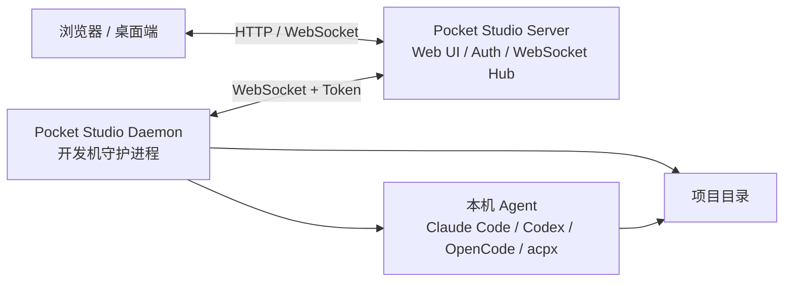

# Pocket Studio

[](https://go.dev)
[](LICENSE)
[](#)

Pocket Studio 是一个远程 AI 编程工作台。它把浏览器里的 Studio UI、中心转发 Server，以及运行在开发机上的 Daemon 连接起来，让你可以在一个界面里管理多台机器、多个项目目录，并调用本机已经安装的 AI 编程工具。

核心思路很简单：

- **Server** 提供 Web UI、认证和 WebSocket 消息转发。
- **Daemon** 运行在真实开发机器上，负责访问项目目录并启动 Agent。
- **Studio UI** 通过浏览器或桌面端连接 Server，实时查看设备、工作区、终端输出和任务状态。
- **Agent** 保持在你的机器上执行，例如 Claude Code、Codex、OpenCode 或 acpx。

## 适合什么场景

- 在浏览器里统一操作家里、公司、服务器上的开发环境。
- 把多个项目目录接入同一个远程 Studio。
- 让 AI Agent 在本机代码和终端环境中执行，而不是把项目上传到第三方工作区。
- 自用时用固定 Token 快速部署，多人使用时开启注册、登录和用户 Token。

## 架构



一次任务的大致流程：

1. 用户在 Studio UI 中选择设备、工作区和 Agent。
2. Server 把任务通过 WebSocket 转发给对应 Daemon。
3. Daemon 在指定项目目录中启动本机 Agent 或终端会话。
4. 输出、状态、文件结果和终端流实时回传到 Studio UI。

## 组件

| 组件 | 位置 | 说明 |
| --- | --- | --- |
| Server | `cmd/server` | HTTP 服务、认证、Token、WebSocket Hub、内嵌前端静态资源 |
| Daemon | `cmd/daemon` | 连接 Server，管理工作区，执行 Agent，处理终端和文件操作 |
| Studio 前端 | `studio-frontend` | React + Vite 的主工作台 UI，也包含 Electron 桌面端配置 |
| 用户前端 | `user-frontend` | React + Vite 的登录、注册和 Token 管理页面 |
| 协议层 | `internal/protocol` | Server、Daemon、前端之间共享的消息结构 |

## 快速开始

### 单机桌面模式

下载构建好的桌面包后直接启动。Linux AppImage 示例：

```bash
chmod +x PocketStudio-*.AppImage
./PocketStudio-*.AppImage
```

桌面端可以同时启动 UI、Server 和 Daemon，也可以只作为 UI 连接远程 Server。具体行为取决于启动参数和桌面端设置。

### 自用 Server + Daemon

适合只给自己使用。Server 不开启注册登录，只配置一个固定 `admin-token`，Studio 和 Daemon 都使用这个 Token。

启动 Server：

```bash
go run ./cmd/server \
  -server.addr :18080 \
  -server.admin-token dev_token
```

启动 Daemon：

```bash
go run ./cmd/daemon \
  -daemon.server.url ws://localhost:18080/ws/daemon \
  -daemon.server.token dev_token \
  -daemon.workspace ~/Agent
```

访问 Studio：

```text
http://localhost:18080/studio/
```

### 多人注册模式

适合多人共用一个 Server。用户在首页注册、登录并创建自己的 Token；Daemon 使用对应 Token 连接后，只会出现在该用户的 Studio 中。

启动 Server：

```bash
go run ./cmd/server \
  -server.addr :18080 \
  -server.auth.enabled \
  -server.auth.allow-register=true \
  -server.auth.db ~/.config/pocket-studio/server-auth.sqlite
```

访问用户首页：

```text
http://localhost:18080/
```

使用用户 Token 启动 Daemon：

```bash
go run ./cmd/daemon \
  -daemon.server.url ws://localhost:18080/ws/daemon \
  -daemon.server.token ps_user_xxxxx \
  -daemon.workspace ~/Agent
```

## 从源码开发

### 环境要求

- Go 1.26.3+
- Node.js 24+
- npm
- 本机已安装需要调用的 Agent CLI，例如 `claude`、`codex`、`opencode` 或 `acpx`

### 安装依赖

```bash
npm ci --prefix studio-frontend
npm ci --prefix user-frontend
```

### 本地开发启动

终端 1：启动 Server。

```bash
go run ./cmd/server -server.addr :18080 -server.admin-token dev_token
```

终端 2：启动 Daemon。

```bash
go run ./cmd/daemon \
  -daemon.server.url ws://localhost:18080/ws/daemon \
  -daemon.server.token dev_token \
  -daemon.workspace ~/Agent
```

终端 3：启动 Studio 前端开发服务器。

```bash
npm run dev --prefix studio-frontend
```

开发服务器默认使用 Vite。生产访问路径为 Server 提供的 `/studio/`，前端热更新开发时使用 Vite 输出的本地地址。

### 构建前端和二进制

```bash
npm run build --prefix studio-frontend
npm run build --prefix user-frontend

go build -trimpath -ldflags="-s -w" -o ./server ./cmd/server
go build -trimpath -ldflags="-s -w" -o ./daemon ./cmd/daemon
```

如果需要把前端产物嵌入 Server，请把两个前端的 `dist` 内容同步到：

- `cmd/server/embedded/studio/`
- `cmd/server/embedded/user/`

发布脚本会自动完成这一步。

### 构建桌面发布包

```bash
# linux | mac | win
bash scripts/build-packages.sh linux
```

脚本会构建两个前端、Go Server、Go Daemon，并把桌面端产物输出到 `dist/electron/`。

## 配置参考

### Server 参数

| 参数 | 默认值 | 说明 |
| --- | --- | --- |
| `-server.addr` | `:8080` | HTTP 监听地址 |
| `-server.admin-token` | 空 | 管理员 Token；自用模式下可作为固定访问 Token |
| `-server.auth.enabled` | `false` | 是否启用注册、登录和用户 Token |
| `-server.auth.db` | 用户配置目录下的 `pocket-studio/server-auth.sqlite` | 认证 SQLite 数据库路径 |
| `-server.auth.allow-register` | `true` | 开启认证后是否允许新用户注册 |

### Daemon 参数

| 参数 | 默认值 | 说明 |
| --- | --- | --- |
| `-daemon.device.id` | 自动生成 | 设备 ID，会展示给 Server 和 Studio |
| `-daemon.device.name` | 当前主机名 | Studio 中显示的设备名称 |
| `-daemon.server.url` | 必填 | Server 的 Daemon WebSocket 地址，例如 `ws://host:18080/ws/daemon` |
| `-daemon.server.token` | 必填 | Daemon 连接 Server 使用的 Token |
| `-daemon.workspace` | 必填 | 工作区路径，可重复传；支持 `id:name:path` 格式 |
| `-daemon.acpx.enabled` | `true` | 是否启用 acpx Agent 执行 |
| `-daemon.acpx.command` | `acpx` | acpx 命令路径 |
| `-daemon.acpx.agent` | `claude` | acpx 默认 Agent |
| `-daemon.acpx.session-name` | 默认配置值 | acpx 默认会话名 |
| `-daemon.acpx.ttl-seconds` | 默认配置值 | acpx 会话 TTL，单位秒 |
| `-daemon.acpx.args` | 默认配置值 | 逗号分隔的 acpx 全局参数 |
| `-daemon.claude.command` | `claude` | Claude Code 命令路径 |
| `-daemon.claude.args` | 默认配置值 | 逗号分隔的 Claude 参数 |

多个工作区示例：

```bash
go run ./cmd/daemon \
  -daemon.server.url ws://localhost:18080/ws/daemon \
  -daemon.server.token dev_token \
  -daemon.workspace "project-a:Project A:/home/me/projects/a" \
  -daemon.workspace "project-b:Project B:/home/me/projects/b"
```

## Daemon 配置示例

仓库中的 `agentbridge.daemon.json` 记录了 Daemon 配置结构，可作为字段参考：

```json
{
  "device": {
    "id": "dev_my_machine",
    "name": "My Dev Machine"
  },
  "server": {
    "url": "ws://localhost:18080/ws/daemon",
    "token": "dev_token"
  },
  "claude": {
    "command": "claude",
    "args": ["--output-format", "stream-json", "--verbose"]
  },
  "acpx": {
    "enabled": true,
    "command": "acpx",
    "agent": "claude",
    "session_name": "agentbridge",
    "ttl_seconds": 300,
    "args": ["--format", "json", "--approve-all"]
  },
  "workspaces": [
    {
      "id": "my-project",
      "name": "My Project",
      "path": "/home/me/projects/my-project"
    }
  ]
}
```

当前 `cmd/daemon` 入口通过命令行参数启动。与上面示例等价的常用启动方式是：

```bash
go run ./cmd/daemon \
  -daemon.device.id dev_my_machine \
  -daemon.device.name "My Dev Machine" \
  -daemon.server.url ws://localhost:18080/ws/daemon \
  -daemon.server.token dev_token \
  -daemon.claude.command claude \
  -daemon.claude.args "--output-format,stream-json,--verbose" \
  -daemon.acpx.enabled \
  -daemon.acpx.command acpx \
  -daemon.acpx.agent claude \
  -daemon.acpx.session-name agentbridge \
  -daemon.acpx.ttl-seconds 300 \
  -daemon.acpx.args "--format,json,--approve-all" \
  -daemon.workspace "my-project:My Project:/home/me/projects/my-project"
```

## 测试和校验

```bash
go test ./...
npm run build --prefix studio-frontend
npm run build --prefix user-frontend
npm run lint --prefix studio-frontend
```

根据改动范围选择最小必要校验。后端协议、认证、Daemon 行为相关改动应至少运行 `go test ./...`；前端 UI 改动应至少运行对应前端的 `build` 或 `lint`。

## 项目结构

```text
pocket-studio/
├── cmd/
│   ├── server/                 # Server 入口和内嵌前端资源
│   └── daemon/                 # Daemon 入口
├── internal/
│   ├── auth/                   # 用户、会话和 Token 认证
│   ├── daemon/                 # Daemon 配置、连接、Agent 执行和终端管理
│   ├── hostinfo/               # 主机和设备信息
│   ├── protocol/               # 共享消息协议
│   └── server/                 # WebSocket Hub 和消息路由
├── studio-frontend/            # Studio React/Vite 前端和 Electron 配置
├── user-frontend/              # 用户登录注册 React/Vite 前端
├── packaging/                  # 桌面端打包资源
├── scripts/                    # 构建、测试和辅助脚本
├── dist/                       # 构建输出目录
├── agentbridge.daemon.json     # Daemon 配置结构示例
├── go.mod
└── go.sum
```

## 支持的 Agent

Pocket Studio 的 Daemon 设计为命令行 Agent 调度层，当前代码路径覆盖：

| Agent / Runtime | 说明 |
| --- | --- |
| acpx | 默认启用，可通过 ACP 风格会话执行不同 Agent |
| Claude Code | 通过 `claude` 命令执行，支持自定义参数 |
| Codex / OpenCode 等 | 可通过 acpx 或后续 Runtime 扩展接入 |

实际可用能力取决于开发机器上安装的 CLI、登录状态、权限配置和 Daemon 参数。

## 常见问题

### Server 页面为空或提示缺少前端文件

先构建前端，并确保产物已经放入 Server 的内嵌目录。使用发布脚本最省事：

```bash
npm ci --prefix studio-frontend
npm ci --prefix user-frontend
bash scripts/build-packages.sh linux
```

### Daemon 连不上 Server

检查三件事：

- `-daemon.server.url` 是否使用 Daemon WebSocket 地址，例如 `ws://localhost:18080/ws/daemon`。
- `-daemon.server.token` 是否与 Server 的 `admin-token` 或用户 Token 一致。
- Server 监听地址、防火墙和反向代理是否允许 WebSocket。

### 如何重命名设备

启动时传入：

```bash
go run ./cmd/daemon \
  -daemon.device.name "Workstation" \
  -daemon.server.url ws://localhost:18080/ws/daemon \
  -daemon.server.token dev_token \
  -daemon.workspace ~/Agent
```

也可以在 JSON 配置文件的 `device.name` 中设置。

### 工作区路径如何写

最简单是直接传路径：

```bash
-daemon.workspace ~/Agent
```

需要稳定 ID 和显示名称时使用 `id:name:path`：

```bash
-daemon.workspace "agent:Agent Projects:/home/me/Agent"
```
