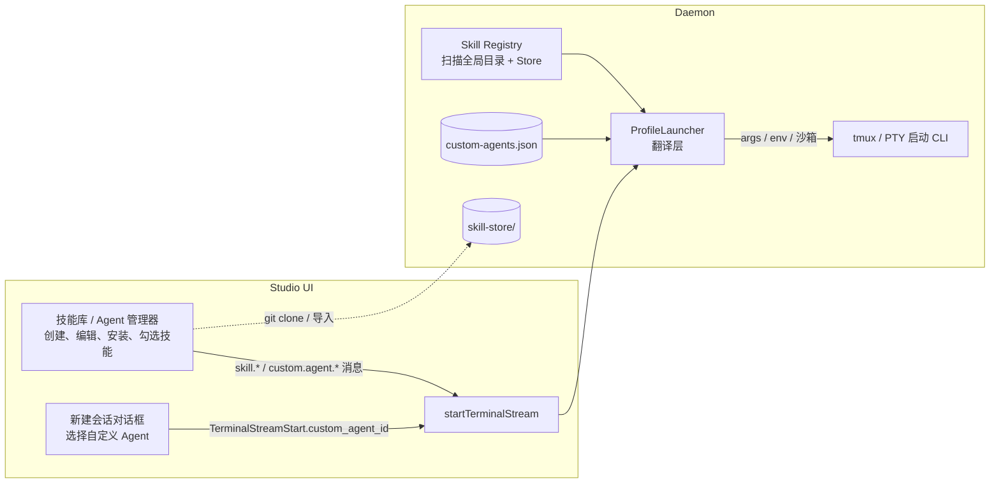

# 自定义 Agent(Custom Agents)与 Skill Store 完整方案

> 状态: 待评审 v2(整合 Skill Store 受管仓库 + 全 CLI 调研结论)
> 目标: 用户可创建由 Daemon 统一管理的自定义 Agent「底层 CLI + 技能集 + 描述 + 系统提示词」;按 agent_id 启动,daemon 用定义覆盖命令;专用技能(小说/图像工具等)安装与使用全程不污染全局。

---

## 1. 背景与问题

当前所有终端类型(Claude Code / Codex / OpenCode / Pi / Qwen / Kimi / Kilo 等)启动时,读取机器上的**全局 skills 目录**(如 `~/.pi/agent/skills/`、`~/.agents/skills/`)。两个痛点:

1. **加载污染**: 每个 skill 的 name+description 都注入 system prompt。本机 `~/.pi/agent/skills` 已有 69 个、`~/.agents/skills` 41 个——小说、图像、宝塔运维这类专用技能与不相干项目互相干扰,白白消耗上下文。
2. **安装污染**: 即便只想在某类项目用,skill 也必须装进 agent 的全局发现目录才生效——装下的那一刻,所有普通会话都能看见它。

需求:能自定义 agent——选底层 CLI 工具(pi/codex/opencode/claude/…)、勾选技能集合、按会话应用;**新技能安装时即可与全局隔离**。只需支持 CLI 终端类型(Direct ACP 作为后续增强)。

---

## 2. CLI Agent 自定义 Skill 能力调研结论

### 2.1 能力矩阵(按可定制性分级)

| 等级 | Agent | 机制 | 排除全局 skills |
| --- | --- | --- | --- |
| ★★★★★ | **Pi** | `--skill <path>`(可重复,任意路径)+ `--no-skills` 关闭自动发现 | ✅ 白名单,最干净 |
| ★★★★★ | **Kimi** | `--skills-dir <dir>`(可重复);官方一处文档称"替换自动发现的用户/项目目录"(另一处称 append,以实测为准) | ✅ 替换式 |
| ★★★★☆ | **OpenCode** | `OPENCODE_CONFIG_CONTENT` 内联配置:`skills` 数组(本地目录+HTTP)+ `permission.skill` 按名称/通配符 allow/deny/ask,支持 per-agent | ⚠️ 需 `"*":"deny"` 兜底(它也读全局 `~/.claude/skills`、`~/.agents/skills`) |
| ★★★★☆ | **Claude Code** | `CLAUDE_CONFIG_DIR=<沙箱>` 重定向整个 `~/.claude`(官方确认);沙箱 `skills/` 放 symlink;`disableBundledSkills` 可关内置;凭据 symlink 回真实 home | ✅ 沙箱隔离 |
| ★★★☆☆ | **Kilo Code** | 配置 `skills.paths` 数组(任意路径)+ `skills.urls`(远程目录);项目已有 `KILO_CONFIG_CONTENT` 注入通道 | ⚠️ 能否排除 `~/.kilocode/skills/` 待实测 |
| ★★★☆☆ | **Codex** | `CODEX_HOME=<沙箱>`(官方确认含 skills 状态根)+ `config.toml` `[[skills.config]] path=... enabled=false` 按路径禁用单个 skill;skills 整体仍是 experimental | ⚠️ `~/.agents/skills` 用户级发现是否随沙箱走待验证 |
| 明确排除 | **Qwen Code** | 虽支持 `skills.directories`,但只能追加、无法排除全局技能 | 不进入自定义 Agent 创建器 |
| 明确排除 | **Gemini CLI** | skills 位置固定且无自定义路径能力 | 不进入自定义 Agent 创建器 |
| 不支持 | Cursor Agent / Copilot / OpenClaw / Antigravity / dsh | 无公开 skills 自定义机制 | — |

### 2.2 关键结论

1. 自定义 Agent 的产品范围只支持 **Pi、Kimi、OpenCode、Claude Code、Kilo Code、Codex** 六家。
2. 六家都能消费 Skill Store:pi/kimi 走 CLI 参数,opencode/kilo 走配置路径数组,claude/codex 走配置目录沙箱。
3. **Qwen 和 Gemini 明确排除**:保留现有普通终端入口,但不出现在自定义 Agent 创建器(仅六家:pi/kimi/opencode/claude/codex/kilo)、不支持技能注入、不做任何降级或项目物化。
4. Agent Skills 开放标准(agentskills.io)的 `SKILL.md` 目录格式可在六家支持范围内复用,store 里的技能只需保存一份。
5. **Registry 来源固定且不可配置**:只扫描当前机器的 `~/.agents/skills` 与 `~/.config/pocket-studio/skill-store`;所有 agent 私有目录(`~/.pi/agent/skills`、`~/.claude/skills`、`~/.qwen/skills` 等)一律忽略。

### 2.3 各 CLI 细节备忘

- **Pi**: `--no-skills` 后 `--skill` 仍可用(additive);`--skill` 接受文件或目录;项目级 `.pi/skills`/`.agents/skills` 信任后才加载。
- **Claude Code**: `CLAUDE_CONFIG_DIR` 官方文档确认("every `~/.claude` path lives under that directory instead");`--settings <file>` 可传设置文件;`.claude.json`(登录态)不受该变量影响。
- **Codex**: `CODEX_HOME` 目录**必须预先存在**;skills 发现位置 = repo(从 cwd 向上到 repo root 的 `.agents/skills`)、user(`$HOME/.agents/skills`)、admin(`/etc/codex/skills`)、system(内置);支持 symlinked skill folders;skills 列表预算 = 上下文的 2% 或 8000 字符。
- **OpenCode**: 配置优先级含 `OPENCODE_CONFIG`(文件)与 `OPENCODE_CONFIG_CONTENT`(内联,运行时覆盖);`tools:{"skill":false}` 可整体关闭;v2 文档确认 `skills` 数组支持本地目录与 HTTP catalog。
- **Kimi**: `kimi --skills-dir <path>` 可重复。
- **Kilo**: kilo.ai 文档确认 `{"skills":{"paths":[...],"urls":[...]}}`;全局目录 `~/.kilocode/skills/`。
- **Qwen / Gemini**: 调研结论保留为决策依据,但产品明确不接入自定义 Agent;原普通终端保持不变。

---

## 3. 总体设计

### 3.1 核心概念

- **自定义 Agent(Custom Agent)** = { id, 名称, 描述, **底层 CLI**(pi/kimi/opencode/claude/codex/kilo), **系统提示词 system_prompt**, 选中技能集合(受管+共享全局), extra_env, extra_args }。由 Daemon 统一管理的一等实体：前端启动只传 `agent_id`，Daemon 用定义里的 base CLI 覆盖启动命令并注入技能与提示词。
- **Skill Store(受管技能仓库)** = Pocket Studio 自己的技能存放地(`~/.config/pocket-studio/skill-store/`),**从不写入任何 agent 的全局发现目录**。
- **Skill Editor(技能编辑器)** = 在页面上创建、浏览和编辑当前选中机器的技能文件;Daemon 只开放 Store 与 `~/.agents/skills` 两个允许根目录。

### 3.2 两类技能,两个家

| | 位置 | 谁能看见 |
| --- | --- | --- |
| **共享全局技能** | `~/.agents/skills`(唯一扫描的共享目录) | 普通会话可能自动发现;自定义 Agent 可原地引用 |
| **受管技能**(小说/图像等专用) | `~/.config/pocket-studio/skill-store/` | **只有**引用它的自定义 Agent 启动的会话 |

所有 agent 私有目录(如 `~/.pi/agent/skills`、`~/.claude/skills`、`~/.qwen/skills`)不进入 Registry。需要复用其中的 skill 时,用户通过页面“导入到 Store”或自行迁移到 `~/.agents/skills`。

> 核心洞察: `pi --skill`、kimi `--skills-dir`、opencode `skills` 数组等机制全部接受**任意路径**——skill 根本不需要装进 agent 的发现目录。安装进 store 的那一刻就是零污染,普通会话永远发现不了它。

### 3.3 架构



设计原则:

1. **单一翻译层**: `buildSkillLaunchPlan(base, agent) → LaunchPlan{args, env, sandbox, warnings}` + `applyCustomAgentToTerminalCommand`(覆盖命令+注入提示词)。终端与(未来的)Direct ACP 共用,per-agent 规则互相隔离。
2. **严格限定文件边界**:Registry 与页面编辑器只访问 `~/.agents/skills` 和 Store;agent 私有目录及机器其他路径不扫描、不编辑。
3. **默认零行为变化**: 不选自定义 Agent = 完全保持现状(不加 env、不改命令)。
4. **严格限定支持范围**:自定义 Agent 创建器仅列出六家受支持 CLI;Qwen/Gemini 与其他不支持 Agent 不显示,不提供降级。
5. **按设备隔离**:Skill Catalog、Store、自定义 Agent 与文件编辑都属于当前选中 Daemon 所在机器;Server 只鉴权与中转,不保存 skill 文件。

---

## 4. 数据模型与存储

### 4.1 Skill Store `~/.config/pocket-studio/skill-store/`

```
skill-store/
├── novel-toolkit/SKILL.md        # 来源: git clone --depth 1
├── doubao-imagegen/SKILL.md      # 来源: 本地目录导入
└── web-novel-prompt-lib/SKILL.md # 来源: 脚手架新建
```

安装方式(技能库管理器内完成):

| 来源 | 动作 |
| --- | --- |
| git URL | `git clone --depth 1 <url> skill-store/<name>/`(记录 origin,支持 git pull 升级) |
| 本地目录 | 校验后复制入 Store(不允许注册 Store/`~/.agents/skills` 之外的原路径) |
| 手动新建 | 生成标准 SKILL.md 模板(frontmatter: name + description) |

存量治理(P2,可选): 对已误装进全局目录的专用技能,提供一键「移入受管仓库」(`mv` + 自定义 Agent 引用自动更新),把过去的污染清回去。

安全提示: skill 内容可能指示模型执行任意操作(同任何 skill 安装),UI 安装时展示 SKILL.md 描述并保留确认步骤;store 内容在技能库中可随时查看。

### 4.2 自定义 Agent 存储 `~/.config/pocket-studio/custom-agents.json`

Registry 来源不是配置项,固定为:

```text
~/.agents/skills                              # shared-global,可在页面创建/编辑
~/.config/pocket-studio/skill-store           # managed,默认创建位置
```

```jsonc
{
  "version": 1,
  "agents": [
    {
      "id": "agent_novel",
      "name": "小说创作",
      "description": "网文写作 + 封面图生成",
      "base_agent": "pi",            // 底层 CLI，daemon 启动时用它覆盖命令
      "system_prompt": "你是一位网文写作助手…",  // 可选，per-CLI 注入
      "skills": [               // name 展示用;path 是权威引用(含 store 绝对路径)
        { "name": "novel-toolkit", "path": "~/.config/pocket-studio/skill-store/novel-toolkit" },
        { "name": "doubao-imagegen", "path": "~/.config/pocket-studio/skill-store/doubao-imagegen" },
        { "name": "pdf", "path": "~/.agents/skills/pdf" }   // 共享全局技能原地引用
      ],
      "extra_env": {},          // 高级:附加环境变量
      "extra_args": {}          // 高级:按 agent 附加参数
    }
  ]
}
```

> Registry 只扫描 `~/.agents/skills` 与 Store,且该范围不可通过配置扩大。它只解析技能元数据,不会把技能注入模型上下文。页面文件 API 复用同一允许根目录。

### 4.3 Protocol 改动 `internal/protocol/protocol.go`

```go
type SkillSummary struct {
    Name        string `json:"name"`
    Description string `json:"description,omitempty"`
    Path        string `json:"path"`
    Source      string `json:"source"`     // "shared-global" | "store"
    Managed     bool   `json:"managed"`    // store 技能可 upgrade
    Writable    bool   `json:"writable"`   // daemon 实际权限检测
    Revision    string `json:"revision"`   // 内容 hash,用于并发保存检测
}

type SkillRef struct {
    Name string `json:"name"`
    Path string `json:"path"`
}

type CustomAgent struct {
    ID           string              `json:"id"`
    Name         string              `json:"name"`
    Description  string              `json:"description,omitempty"`
    BaseAgent    string              `json:"base_agent"` // pi | kimi | opencode | claude | codex | kilo
    SystemPrompt string              `json:"system_prompt,omitempty"` // per-CLI 注入(见 5.1)
    Skills       []SkillRef          `json:"skills"`
    ExtraEnv     map[string]string   `json:"extra_env,omitempty"`
    ExtraArgs    map[string][]string `json:"extra_args,omitempty"`
}

// TerminalStreamStart 追加:
type TerminalStreamStart struct {
    // ...现有字段...
    CustomAgentID string `json:"custom_agent_id,omitempty"`
}
```

新增消息(envelope 中转 + direct web 两条通道,所有请求明确携带 `device_id`):

- `skill.catalog.list` → `{skills: []SkillSummary}`
- `custom.agent.list` / `custom.agent.save` / `custom.agent.delete`
- `skill.store.install`(git url / 本地路径)/ `skill.store.remove` / `skill.store.upgrade`(git pull)
- `skill.create` → 在 Store(默认)或 `~/.agents/skills` 创建标准目录与 SKILL.md
- `skill.file.tree` / `skill.file.read` / `skill.file.write`
- `skill.file.create` / `skill.file.rename` / `skill.file.delete`
- `skill.validate` → 校验 frontmatter、name/description、目录结构与路径引用
- `skill.support.matrix` → per-agent 支持等级与告警
- `DaemonHello.Features` 追加 `"custom.agents.v1"`、`"skill.editor.v1"`

### 4.4 页面技能编辑器的 Daemon 规则

文件操作必须由 Daemon 执行,并满足以下约束:

1. **根目录白名单**: 请求只接受 `skill_id + relative_path`,不接受前端传任意绝对路径。Daemon 从 Registry 解析 skill 根目录,并确认它位于 Store 或 `~/.agents/skills`。
2. **防路径逃逸**: `filepath.Clean` + `EvalSymlinks` 后再次校验真实路径仍在允许根内;拒绝 `..`、绝对路径、symlink 指向根外。
3. **原子保存**: 沿用项目现有 atomic file 写入模式;写临时文件后 rename,避免断线产生半文件。
4. **并发检测**: `skill.file.read` 返回内容 hash(`revision`);write 必须携带 `expected_revision`,不一致返回 conflict,由 UI 提供重新加载/对比,不静默覆盖。
5. **文本/二进制边界**: P0 可编辑 UTF-8 文本(SKILL.md、md/json/yaml/toml/js/ts/py/sh 等);图片和其他二进制只展示元信息/下载,不在文本编辑器打开;设置单文件大小上限。
6. **Git 状态**: git clone 安装的受管 skill 被页面编辑后标记 dirty;`skill.store.upgrade` 在 dirty 时拒绝或要求用户先确认,避免 `git pull` 覆盖本地修改。
7. **权限**: `Writable` 由当前 Daemon 用户实际文件权限决定;只读技能隐藏写操作。删除整个 skill 需要二次确认。
8. **校验**: 保存 SKILL.md 后立即校验 YAML frontmatter(`name`、`description`)、目录名/skill 名规则;错误不阻止保存草稿,但阻止加入自定义 Agent 或启动,直到校验通过。

---

## 5. 核心机制:ProfileLauncher 翻译层

新文件 `internal/daemon/skill_profile.go`(模型/存储/Registry)与 `skill_profile_launcher.go`(翻译):

```go
type SkillLaunchPlan struct {
    Args       []string // 追加到命令行
    Env        []string // 追加到环境变量
    SandboxDir string   // 已物化的沙箱目录(claude/codex/kimi 用)
    Warnings   []string // 如 "codex skills 为实验特性"、"kilo 尚未确认能排除全局技能"
}

// 入口: applyCustomAgentToTerminalCommand(command, agentID, env)
// → 用 baseAgentCommand(base) 覆盖命令,叠加技能 plan 与 system_prompt 注入
func buildSkillLaunchPlan(base string, agent protocol.CustomAgent) (*SkillLaunchPlan, error)
```

### 5.1 per-agent 翻译规则

**系统提示词注入(system_prompt)**:

| CLI | 注入方式 |
| --- | --- |
| pi | `--append-system-prompt <text>` |
| claude | `--append-system-prompt <text>` |
| opencode / kilo | 物化 `AGENTS.md`(env `POCKET_STUDIO_AGENT_PROMPT_FILE` 指向,会话内引导加载) |
| codex / kimi | 同上(写入 `agent-prompts/<agent_id>/AGENTS.md`) |

**pi —— 白名单,纯参数**
```
pi --no-skills --skill /store/novel-toolkit --skill ~/.agents/skills/pdf
```

**kimi —— 目录替换,纯参数**
物化沙箱聚合目录(内含选中项 symlink)后:
```
kimi --skills-dir <sandbox>/kimi-skills
```

**opencode —— 内联配置 + permission 兜底**
```
OPENCODE_CONFIG_CONTENT={"skills":["/store/novel-toolkit","..."],
  "permission":{"skill":{"*":"deny","novel-toolkit":"allow","...":"allow"}}}
```
(若实测具体名不能覆盖 `*`,改为枚举 deny 全局其余项。)

**kilo —— 内联配置(复用现有通道)**
```
KILO_CONFIG_CONTENT={"skills":{"paths":["/store/novel-toolkit","..."]}}
```
⚠️ 与现有 hook 插件注入共用 `KILO_CONFIG_CONTENT` env——**必须合并 JSON 键**(`plugin` + `skills`),不能覆盖(见 5.3)。

**claude —— 配置目录沙箱**
```
<sandbox>/claude-home/
├── skills/            # 选中项 symlink
├── settings.json      # {"disableBundledSkills": true}(可选)
├── .credentials.json  -> ~/.claude/.credentials.json   # symlink 保登录
└── projects -> ~/.claude/projects                       # 可选,保历史
env: CLAUDE_CONFIG_DIR=<sandbox>/claude-home
```
⚠️ 现有 `writeClaudeHookIntegration()` 把 hook 写到全局 `~/.claude`——沙箱启用时 hook 文件必须写进沙箱目录,否则任务通知失效(见 5.3 接入顺序)。

**codex —— 状态根沙箱 + deny-list**
```
<sandbox>/codex-home/          # CODEX_HOME 要求目录预先存在
├── auth.json -> ~/.codex/auth.json    # symlink 保登录
├── config.toml               # 继承用户原内容 + [[skills.config]] enabled=false 逐个禁用未选中的全局技能
└── skills/                   # 选中项 symlink
env: CODEX_HOME=<sandbox>/codex-home
```

**Qwen / Gemini —— 明确不支持**

- 不实现 ProfileLauncher 分支、不创建沙箱、不物化到项目目录。
- 不出现在自定义 Agent 创建器的 CLI 列表中。
- 现有普通 Qwen/Gemini 终端卡片与启动行为保持不变。

**其他不支持 agent**
同样不进入自定义 Agent 创建器;若收到伪造/旧客户端请求,daemon 返回 `errUnsupportedAgent`。

### 5.2 沙箱物化规则

- 位置 `~/.config/pocket-studio/skill-sandboxes/<agent_id>/<base>/`;每次启动幂等重建(symlink 开销极小);Agent 删除时清理。
- **受管技能无需物化**(pi/opencode 直接引用 store 绝对路径);只有 claude/codex/kimi 需 symlink 聚合目录。
- **Windows**: symlink 需开发者模式/管理员 → 降级目录联接(junction)或复制;加平台分支(仓库已有 `process_tree_windows.go` 先例)。
- 凭据**只 symlink 不复制**,避免泄密面扩大。

### 5.3 接入点与顺序(现状代码)

`daemon.go startTerminalStream()`,关键在于**先算自定义 Agent 方案(覆盖命令),再走 hook 注入**:

```go
terminalCommand := d.normalizeTerminalCommand(req.Command)
agentName := agentTerminalCommand(terminalCommand)
+ var skillEnv []string
+ if req.SkillProfileID != "" {
+     terminalCommand, env, agentName, err = applyCustomAgentToTerminalCommand(terminalCommand, req.CustomAgentID, nil)
+     terminalCommand = appendArgs(terminalCommand, plan.Args)
+     skillEnv = plan.Env
+ }
agentHooks := d.prepareTerminalAgentHooks(...)  // claude hook 需感知沙箱: CLAUDE_CONFIG_DIR 已在 skillEnv 中,hook 文件写入目标随之切换; kilo 的 KILO_CONFIG_CONTENT 需与 skills.paths 合并
command := terminalAgentCommandWithHooks(terminalCommand, agentName, merge(agentHooks.env, skillEnv))
```

与现有 `agentHooks.env` 注入机制同路,天然兼容 tmux 与裸 PTY 两种后端;`agentTerminalCommand()` 无需改动(仍是 CLI 名检测)。

---

## 6. 前端改动(studio-frontend)

1. **新建会话对话框** `new-session-dialog.tsx`:
   - 新增「自定义 Agent」类目,卡片列出 `custom.agent.list` 结果;选中即以 `custom_agent_id` 启动,前端不需要知道底层 CLI。
   - 自定义 Agent 创建器的 CLI 列表固定为 **Pi / Kimi / OpenCode / Claude Code / Kilo / Codex**;Qwen/Gemini 不显示。普通终端列表不变。
   - 能力经 `DaemonHello.Features`(`custom.agents.v1`)控制显隐;不支持的老 daemon 显示"无法加载"提示。
   - payload 增加 `skillProfileId`。
2. **技能库与自定义 Agent 管理器**(新组件 `skill-agent-manager.tsx`,入口在设置区,按当前设备加载):
   - 「技能库」页:只展示当前机器 Store + `~/.agents/skills`;搜索 + 「共享全局/受管」来源标签 + 校验/dirty/只读状态。
   - 新建技能:填写 name/description,位置默认「受管 Store」;可主动选择「共享全局 `~/.agents/skills`」,并明确提示该技能可能被普通 Agent 会话自动发现。
   - 安装:git URL 克隆 / 本地目录导入 → Store;受管技能支持升级(git pull)、复制、删除。
   - 「技能编辑」页:左侧技能文件树,右侧文本编辑器;支持新建文件/目录、重命名、删除、保存、校验结果与冲突处理。优先复用项目已有文件编辑器能力,不另造编辑内核。
   - 「自定义 Agent」页:Agent 卡片 + 新建/编辑对话框(名称/描述/底层 CLI 六选一/系统提示词/技能多选)。
   - CRUD 走 `skill.*` 消息;切换设备时清空当前编辑缓存并重新读取对应 Daemon。
3. **终端标签徽标**: 会话标题旁显示 Agent 徽标(自定义 Agent 的 tab 标题直接用 agent 名称)。
4. `terminal-types.tsx`: `TerminalKind` 不变;档案能力经 `DaemonHello.Features` + 支持矩阵控制显隐。

---

## 7. 边界情况与风险

| 风险 | 缓解 |
| --- | --- |
| Codex skills 为 experimental,行为可能变 | per-agent 规则单文件隔离;版本探测 + warning 上报 UI |
| 语义与文档不符(kimi append、opencode 通配符优先级、kilo 排除) | P0 先跑 `verify-skill-isolation.sh` 实测(§10),以实测固化规则 |
| Windows symlink 受限 | junction/复制降级;CI 跑翻译层单测 |
| 凭据/登录态被沙箱破坏 | 只 symlink 不复制;claude `.claude.json` 不受 `CLAUDE_CONFIG_DIR` 影响;首条消息无响应时提示检查登录 |
| hook 注入与 Agent 注入冲突(KILO_CONFIG_CONTENT 覆盖、claude hook 写错目录) | 5.3 固定接入顺序;合并 JSON;集成测试覆盖 hook+自定义 Agent 同时启用 |
| 同名 skill 冲突 | path 为权威引用;Registry 发现同名时前端标黄 |
| Direct ACP 会话不生效 | P3 接入 `direct_acp.go` 的 per-agent `Env`(config.go 已有字段) |
| 项目内 `.agents/skills` 与档案叠加 | 项目级目录仍生效(合理:项目自有约定优先) |
| store 技能内容安全 | 安装时展示 SKILL.md 描述 + 确认;技能库可随时查看内容 |
| 页面文件 API 变成任意文件读写入口 | 只接受 skill_id+相对路径;真实路径必须位于 Store 或 `~/.agents/skills`;symlink 二次校验 |
| 多端同时编辑覆盖 | revision/hash 乐观锁 + 原子写入;冲突必须由用户决定 |
| 编辑 git 技能后升级覆盖本地改动 | dirty 检测;存在修改时阻止或确认 upgrade |

---

## 8. 分期实施

- **P0(最小可用,解决主诉)**
  固定 Registry(Store + `~/.agents/skills`)+ Skill Store(git 克隆 / 本地导入)+ 页面新建技能与文本文件编辑(文件树、原子保存、revision 冲突、SKILL.md 校验)+ `CustomAgent` 数据模型与 `skill.*`/`custom.agent.*` 消息 + 翻译层六家 + system_prompt 注入 + Agent 管理器 + 会话对话框卡片 + 终端接入。
  → 「小说 agent」:页面创建/安装 skill 到 Store → 建自定义 Agent(base=pi,系统提示词+技能) → daemon 以 `pi --no-skills --skill <store>/novel-toolkit --append-system-prompt …` 启动,全局目录零改动。
- **P1**: Windows symlink 降级(junction/复制)+ Agent 徽标细化 + 待验证清单实测回填。
- **P2**: 存量污染「移入受管仓库」一键治理、支持矩阵告警细化、受管技能版本与升级信息。**不包含 Qwen/Gemini 自定义 Agent 支持或降级。**
- **P3**: Direct ACP 运行时接入、自定义 Agent 按项目记忆(某项目默认 Agent)、`skill.urls` 远程目录(kilo)与 HTTP catalog(opencode)支持。

---

## 9. 测试计划

- **单测**: Registry 仅扫描固定两根、agent 私有目录忽略、同名/非法 frontmatter、每个 agent 的 `BuildSkillLaunchPlan` 快照、store 安装/升级/清理、文件路径逃逸与 symlink 逃逸、原子保存、revision conflict、kilo JSON 合并。
- **隔离性断言**: 安装/新建受管技能前后,`~/.agents/skills` 和所有 agent 私有目录内容**不变**;明确选择「共享全局」时只允许改变 `~/.agents/skills`。
- **集成**: 临时 HOME + 假 skills + 假 CLI 脚本(打印收到的 argv/env),断言注入;tmux 与非 tmux 两路;hook 与自定义 Agent 同时启用(claude hook 位置、kilo config 合并)。
- **人工验证脚本** `scripts/verify-skill-isolation.sh`: 对本机已装 CLI 逐项实测 §10 清单。

## 10. 待验证清单(实现前跑 verify 脚本确认)

1. kimi `--skills-dir`: 替换还是追加?
2. opencode `permission.skill`: 具体名 vs `*` 的优先级。
3. codex `CODEX_HOME` 是否重定向 user 级发现(`$CODEX_HOME/skills` vs `~/.agents/skills`);`[[skills.config]]` 能否引入任意路径。
4. claude `CLAUDE_CONFIG_DIR` 沙箱下登录态(`.credentials.json` symlink)与 `/login` 流程。
5. kilo `KILO_CONFIG_CONTENT` 注入 `skills.paths` 是否生效;能否排除 `~/.kilocode/skills/`。

---

## 附录: 用户旅程(新增小说 agent)

1. 技能库 → 新建技能;位置保持默认「受管 Store」,填写 name/description,页面生成并打开 `SKILL.md`。
2. 在技能编辑器里编辑 SKILL.md,按需创建 `references/`、`scripts/` 等文件;校验通过后保存。
3. 新建自定义 Agent「小说创作」,底层 CLI 选 `pi`,填写系统提示词,勾选刚创建的 novel-toolkit。
4. (可选)再勾选 `~/.agents/skills/pdf` 等共享全局技能。
5. 保存。新建会话 → 「自定义 Agent」类目 → 选「小说创作」卡片。
6. 启动: `pi --no-skills --skill ~/.config/pocket-studio/skill-store/novel-toolkit --skill ~/.agents/skills/pdf`。
7. 其他任何不选自定义 Agent 的 `pi` / `claude` / `codex` 会话——完全看不见 novel-toolkit。
